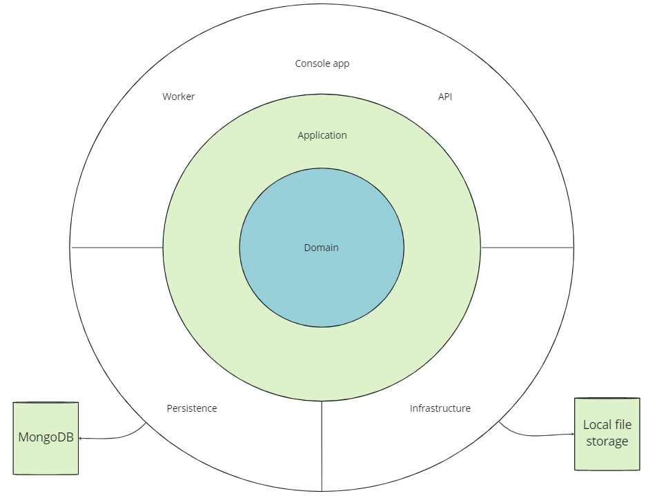

# mowers-clean-architecture

An implementation of the mowers problem using clean architecture solution in C#.

## Development process

### Version 0

The first version of the application was a simple Console application. The goal of this version was to setup an MVP using the Clean Architecture template.

### Version 1

For the second version, an API has been added to allow users to upload a file containing instructions. In this version, the processing of the file was made synchronously. When the user uploads a file, the API processes it and returns the final position and orientation of the mowers as JSon or text/plain (based on the Accept header sent by the client).

### Version 2

To improve the file processing in a more complexe environment, I decided to make the file processing asynchronous. A MongoDB database and local file storage were added to store files and processing results. To keep supporting the old version of the API, I used versioning. When a user uploads a file on the V2 API, the file is stored locally and a new processing request is saved in MongoDb. The API returns this processing request to the user with an identifier that allows to retreive the result later.

A worker runs asynchronously to get all the processing requests that have not yet been completed and runs the processing for each file. When the processing of a file is completed, the processing request is updated in MongoDB, allowing the user to retreive the result.

## Architecture

The solution is based on Clean Architecture template. 

### Core

#### Domain layer

The domain layer contains the entities of the application: mowers, lawns and file processing. It's in this layer that the business rules are implemented.

#### Application layer

The application layer contains the use cases that allow to interact with the application. The use cases are separated in commands and queries using a CQRS approach with MediatR. It is in this layer that the interfaces for infrastructure and persistence are defined.

### Persistence 

#### Persistence layer

This layer contains persistence specific classes. The persistence of the application is based on MongoDB.

### Infrastructure
#### Infrastructure layer

The infrastructure layer contains infrastructure specific classes. The file storage logic resides in this layer.

### API
#### Mowers Clean Architecture API

This is the API the user needs to interact with. 

#### File Processor Worker

This is the asynchronous worker that runs the file processing asynchronously.

### UI
#### Console application

The first version of the application, a console app that runs the processing of the given file provided by the user as args.

## Future improvements

### Trigger the worker based on event

In the current version, for each run, the worker tries to get not completed file processing and then runs it sequentially. A better solution is to use a messaging system like Kafka to trigger the worker when a file has been uploaded by the user. 

## TODO

- [X] Add a worker to run file processing asynchronously
- [X] Add command to run stored file processing
- [x] Add a query to get not completed file processing 
- [X] Add TUs
- [ ] Add documentation
- [ ] Add logs
- [ ] Add metrics
- [ ] Add opentelemetry 
- [ ] Improve builds
