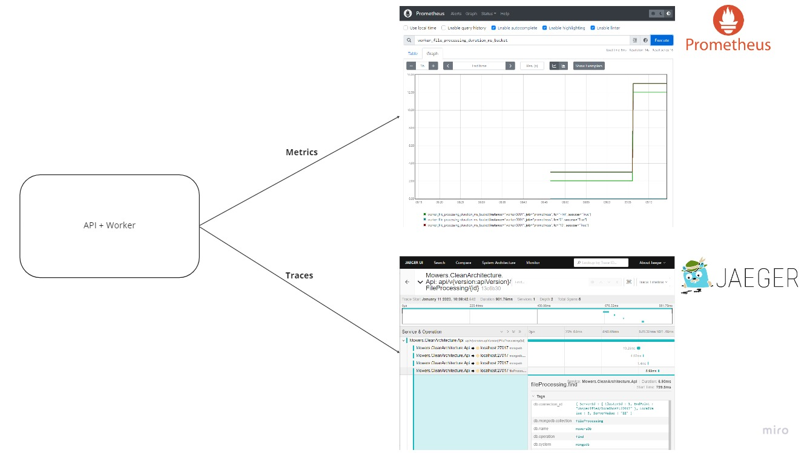

# mowers-clean-architecture
[](https://codecov.io/github/edirand/mowers-clean-architecture)
[](https://codeclimate.com/repos/63bb3635d9ad0d7e450000f6/maintainability)
[](https://dashboard.stryker-mutator.io/reports/github.com/edirand/mowers-clean-architecture/main)


An implementation of the mowers problem using clean architecture solution in C#. The exercise statement can be found [here](docs/01_exercise_statement.md).

## How to run

To run the application, you can use the docker-compose file provided. Clone the repository and run this command in the root folder:  

```sh
docker-compose up -d
```

It will setup the multi-container app **mowers-clean-architecture** composed of:
- **mongo**: an instance of MongoDB, exposed on port 27017
- **api**: an instance of the API, exposed on port 5000
- **worker**: an instance of the Worker
- **prometheus**: an instance of Prometheus, exposed on port 9090
- **jaeger**: an instance of Jaeger, exposed on port 16686
- **healthcheckui**: an instance of HealthCheck-UI, exposed on port 5002
- **file_storage_volume**: a volume to store files to process
- **mongo_data_volume**: a volume to store MongoDB data
- **mongo_configdb_volume**: a volume to store MongoDB configdb
- **prometheus_data**: a volume to store Prometheus data
- **mowers_network**: a network to connect the containers

## Getting started

Runs the docker-compose file (see: [How to run](#how-to-run)).

The component should have been created. Open http://localhost:5002/healthchecks-ui to see the health of the main components. The components should be healthy.

Open http://localhost:5000/swagger to interact with the API and upload a file using the *POST /api/v2/fileprocessing* route. You can find an example of file to import in the API in the [exercise statement](docs/01_exercise_statement.md). Copy the ID returned in the response and use it with the *GET /api/v2/fileprocessing/{id}* route. You should see the result of the file processing.

You can open http://localhost:16686 to open Jaeger and see traces.

You can open http://localhost:9090 to open Prometheus and see traces (see [metrics](./docs/02_metrics.md) to see the available metrics).


## Development process

### Version 0

The first version of the application was a simple Console application. The goal of this version was to setup an MVP using the Clean Architecture template.

### Version 1

For the second version, an API has been added to allow users to upload a file containing instructions. In this version, the processing of the file was made synchronously. When the user uploads a file, the API processes it and returns the final position and orientation of the mowers as JSon or text/plain (based on the Accept header sent by the client).

### Version 2

To improve the file processing in a more complexe environment, I decided to make the file processing asynchronous. A MongoDB database and local file storage were added to store files and processing results. To keep supporting the old version of the API, I used versioning. When a user uploads a file on the V2 API, the file is stored locally and a new processing request is saved in MongoDb. The API returns this processing request to the user with an identifier that allows to retreive the result later.

A worker runs asynchronously to get all the processing requests that have not yet been completed and runs the processing for each file. When the processing of a file is completed, the processing request is updated in MongoDB, allowing the user to retreive the result.


## Architecture

The solution is based on Clean Architecture template. 


### Core

#### Domain layer

The domain layer contains the entities of the application: mowers, lawns and file processing. It's in this layer that the business rules are implemented.

#### Application layer

The application layer contains the use cases that allow to interact with the application. The use cases are separated in commands and queries using a CQRS approach with MediatR. It is in this layer that the interfaces for infrastructure and persistence are defined.

### Persistence 

#### Persistence layer

This layer contains persistence specific classes. The persistence of the application is based on MongoDB.

### Infrastructure
#### Infrastructure layer

The infrastructure layer contains infrastructure specific classes. The file storage logic resides in this layer.

### API
#### Mowers Clean Architecture API

This is the API the user needs to interact with. 

#### File Processor Worker

This is the asynchronous worker that runs the file processing asynchronously.

### UI
#### Console application

The first version of the application, a console app that runs the processing of the given file provided by the user as args.

## Features

### File processing

The solution allows the user to upload files containing instructions to process using the API. 


The API will store the file on a local file system storage and save the processing request in a MongoDB database to be processed later. It then returns the identifier of the request to the user. The user can get the result of the processing using this identifier.


Asynchronously, the FileProcessing worker will get the request and process the file. It saves the result of the processing in the MongoDB database.

### Observability

Both the API and the FileProcessing worker exposes traces and metrics using OpenTelemetry. You can see the list of exposed metrics [here](./docs/02_metrics.md).




The components are configured to export traces to a Jaeger instance and to expose metrics on a specific endpoint, */metrics*, to be collected by Prometheus.

The docker-compose file in this repository will create configured instances for Jaeger and Prometheus so that the traces and metrics are automatically available. 

### Health checks


Both the API and the FileProcessing worker uses health checks, exposed on a specific endpoint: */health*. The health check results are formatted to be collected by HealthChecks-UI. 

The docker-compose file in this repository will create a configured instance of HealthChecks-UI so that the health checks results are automatically available.


## Future improvements

### Trigger the worker based on event

In the current version, for each run, the worker tries to get not completed file processing and then runs it sequentially. A better solution is to use a messaging system like Kafka to trigger the worker when a file has been uploaded by the user. 

### File validation

For now, the files are not validated so an invalid file will just crash the application. A validation step should be add during the file processing to ensure that the application can correctly process it. An additional validation step could be added in the API to ensure that the user sent a not empty text file for example.

### Exception handling

In the application, the exception handling is very basic and should be improved for a better resiliency.

### Add a web application

During the early stages of the solution design, a Blazor web application was planned to allow users to interact easily with the API. It has not been developed yet and could be added in future version. 

## TODO

- [X] Add a worker to run file processing asynchronously
- [X] Add command to run stored file processing
- [x] Add a query to get not completed file processing 
- [X] Add TUs
- [X] Add documentation
- [X] Add logs
- [X] Add metrics
- [X] Add opentelemetry 
- [ ] Improve builds
